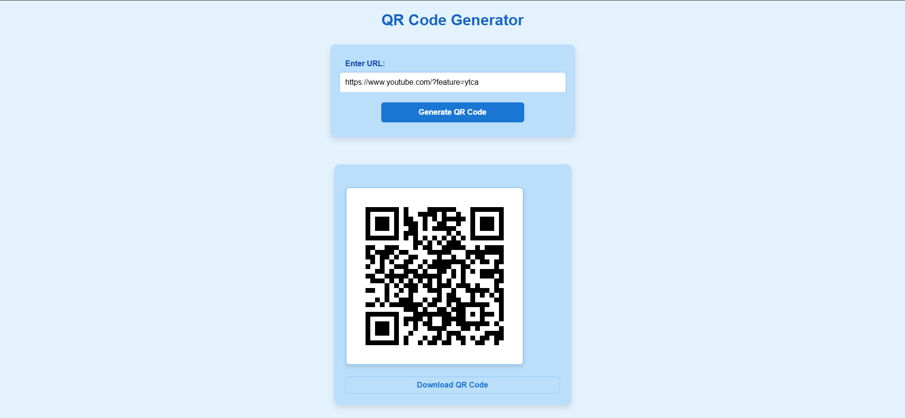

# QR Code Generator

## Overview

This project is a **QR Code Generator** built using **Flask** (backend framework), **Python**, **HTML**, **CSS**, and **JavaScript**. The application allows users to input a URL, generates a QR code for the URL, and provides the option to download the generated QR code as a PNG image.

- Below is an example of my project, the QR code will direct you to YouTube.



---

## Features

- **Generate QR Codes**: Users can input any valid URL and get a corresponding QR code.
- **Downloadable Output**: Generated QR codes are downloadable as PNG files.
- **Responsive Design**: The application is styled for a user-friendly interface across devices.

---

## Project Structure

```plaintext
.
├── app.py                 # Flask application code
├── templates/
│   └── index.html         # HTML template for the web page
├── static/
│   └── style.css          # CSS styles for the application
├── assets/
.   └── qr-code-example.PNG    
```

---

## Getting Started

### Prerequisites

- Python 3.7+
- Pip (Python package manager)

### Installation

1. **Clone the Repository**:
   ```bash
   git clone https://github.com/your-username/qr-code-generator.git
   cd qr-code-generator
   ```

2. **Create a Virtual Environment** (optional but recommended):
   ```bash
   python -m venv venv
   source venv/bin/activate   # On Windows, use `venv\Scripts\activate`
   ```

3. **Run the Application**:
   ```bash
   python app.py
   ```

4. Open your browser and visit `http://127.0.0.1:5000`.

---

## How to Use

1. Open the application in your browser.
2. Enter a valid URL in the input field.
3. Click the **"Generate QR Code"** button.
4. The generated QR code will be displayed below the form.
5. Click the **"Download QR Code"** link to save the image to your device.

---

## Technical Details

### Backend (Flask)

- **`/generate` Endpoint**:
  - Accepts a POST request with JSON data containing the URL.
  - Generates a QR code using the `qrcode` Python library.
  - Returns the QR code image as a downloadable PNG file.

### Frontend (HTML, CSS, JavaScript)

- **HTML**: Provides a form for user input and displays the generated QR code.
- **CSS**: Styles the web page for better usability and aesthetics.
- **JavaScript**:
  - Handles form submissions and communicates with the backend.
  - Dynamically displays the QR code and download link without reloading the page.

---


## License

This project is licensed under the [MIT License](LICENSE). 

---
